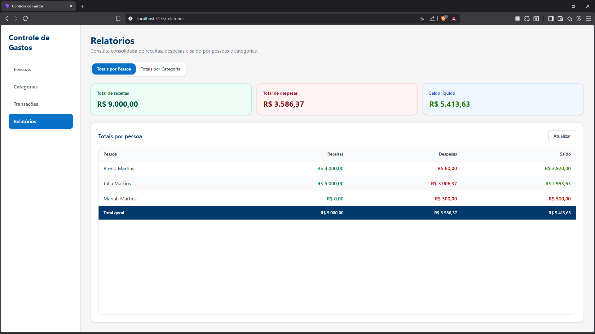
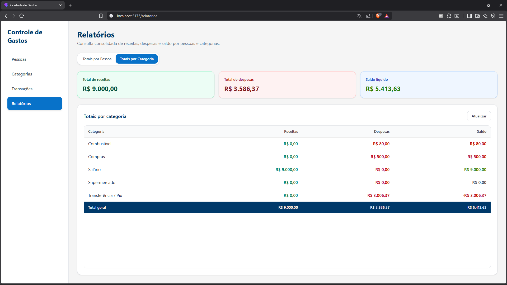
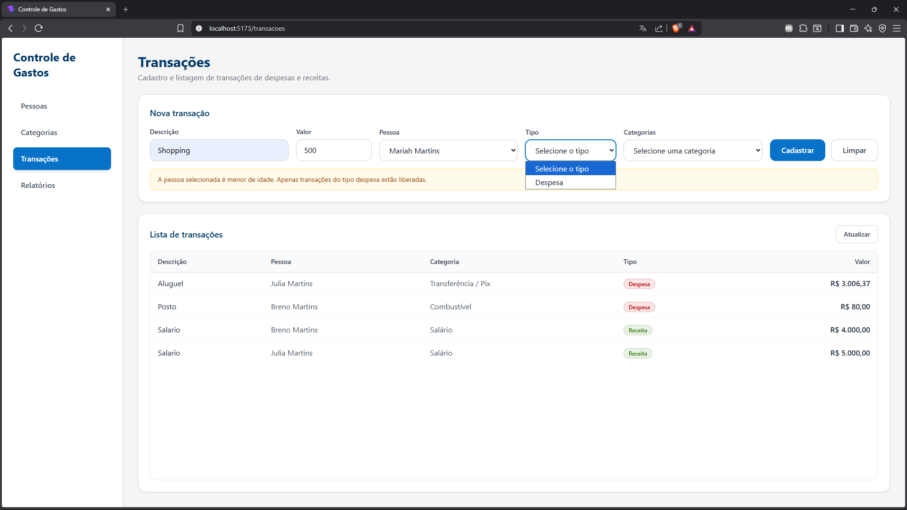
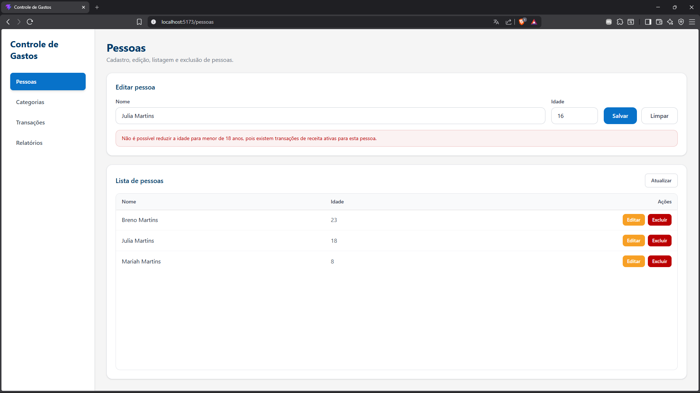

# Controle de Gastos Residenciais

Este projeto é uma solução full-stack para gestão financeira residencial, permitindo o controle de pessoas, categorias e transações. 
O foco principal foi a aplicação de **Clean Architecture**, **DDD (Domain-Driven Design)** e a implementação de **Regras de Negócio**.

## 🛠️ Tecnologias e Padrões

### Back-end
* **Runtime:** .NET 9.0
* **Arquitetura:** Clean Architecture (API, Application, Domain, Infrastructure)
* **ORM:** Entity Framework Core com SQLite
* **Validação:** FluentValidation (Fail-fast validation)
* **Testes:** xUnit, Moq e FluentAssertions
### Front-end
* **Framework:** React com TypeScript e Vite
* **Estilização:** Tailwind CSS (UI Responsiva)
* **Comunicação:** Axios

## 📂 Estrutura do Projeto

* **Domain:** Entidades, Enums e Interfaces de Repositório (Core do negócio).
* **Application:** Serviços, DTOs, Mapeamentos e Validadores (Casos de uso).
* **Infrastructure:** Persistência de dados, Migrations e Configuração de Seed.
* **Api:** Controllers e Middlewares de tratamento de erro.
* **Tests:** Suíte de testes automatizados com Mocking.

## 🧠 Diferenciais e Regras Implementadas

Além do CRUD básico, o sistema entrega comportamentos avançados solicitados e melhorias de segurança:

1.  **Integridade de Dados (Cascade Delete):** Ao excluir uma pessoa, todas as suas transações são removidas automaticamente via configuração de banco de dados.
2.  **Validação de Menor de Idade:** Bloqueio imediato na criação de transações do tipo "Receita" para pessoas menores de 18 anos.
3.  **Compatibilidade de Categoria:** O sistema impede o uso de categorias com finalidades divergentes do tipo da transação (Ex: tentar usar uma categoria de "Receita" em uma despesa).
4.  **Edge Case - Proteção de Idade (Edição):** Implementei uma trava de segurança que impede a redução da idade para menos de 18 anos caso a pessoa já possua transações de receita ativas, garantindo a integridade histórica dos dados.
5.  **Relatório Opcional Concluído:** Implementação completa da consulta de totais por categoria com interface dedicada.

## 📸 Demonstração

**1. Relatórios de Totais (Requisito Obrigatório e Opcional Concluídos)**

| Relatório por Pessoa | Relatório por Categoria |
| :---: | :---: |
|  |  |

**2. Validações e Regras de Negócio (Tratamento de Exceções)**

| Bloqueio: Nova Transação | Proteção de Dados: Edição de Idade |
| :---: | :---: |
|  |  |

## ⚙️ Como Executar o Projeto

### Pré-requisitos
* [.NET 9 SDK](https://dotnet.microsoft.com/download/dotnet/9.0)
* [Node.js](https://nodejs.org/) (versão 18 ou superior)
* [Git](https://git-scm.com/)

### 0. Clonar o Repositório
No seu terminal, escolha uma pasta de destino e execute:
```bash
git clone https://github.com/BrenoMOliveira/controle-gastos-residenciais.git
cd controle-gastos-residenciais
```

### 1. Back-end (API)
Navegue até a pasta do servidor:
```bash
cd backend/src/ControleGastos.Api
```

Atualize o banco de dados (Migrations):
```bash
dotnet ef database update --project ../ControleGastos.Infrastructure
```

Rode a aplicação:
```bash
dotnet run
```

A API estará disponível em http://localhost:5204. Acesse a documentação interativa via Swagger em: http://localhost:5204/swagger

### 2. Front-end (Web)
Em outro terminal, navegue até a pasta web:
```bash
cd frontend
npm install
npm run dev
```

### 3. Testes Unitários
Para validar as regras de negócio:
```bash
cd backend/tests/ControleGastos.Tests
dotnet test
```

### ⚠️ Nota Importante sobre Portas e CORS
Para garantir a estabilidade da avaliação, o projeto está configurado com portas fixas:
* **API:** `5204`
* **Web:** `5173`

Caso a porta `5173` já esteja ocupada na sua máquina e precise de utilizar outra para o Front-end, será necessário atualizar a política de segurança (CORS) para que a API não bloqueie os pedidos. Para isso, altere:
1. No Front-end: O ficheiro `vite.config.ts` (propriedade `port`).
2. No Back-end: O ficheiro `Program.cs` (atualize o URL na configuração do `AddCors`).